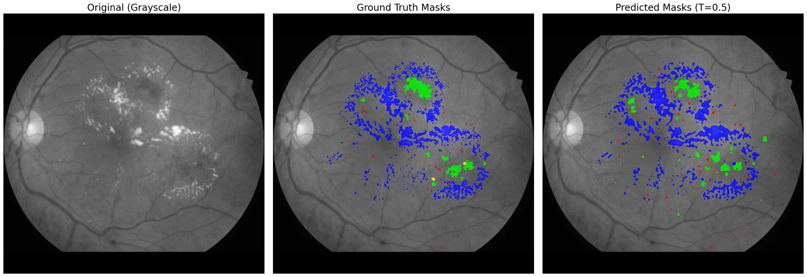

# IDRiD ResUNet++ Multi-Task Learning
PyTorch implementation of a multi-task deep learning pipeline for **Diabetic Retinopathy (DR)** and **Diabetic Macular Edema (DME)**. This project leverages a **ResUNet++** architecture with **CORAL (Consistent Rank Logits)** heads to perform simultaneous pixel-level lesion segmentation and ordinal grade classification.

## 📸 Inference Result
The following plot demonstrates the model's performance on a test fundus image, comparing the Ground Truth (GT) against model predictions using a multi-channel colored overlay on a grayscale anatomical background.



---

## 🏗️ Architecture Overview
The model is designed to handle the inherent class imbalance and ordinal nature of medical grading:

* **Backbone:** ResNet-based Feature Extractor (supports R18 through R152).
* **Segmentation Branch:** * **ASPP (Atrous Spatial Pyramid Pooling):** Captures multi-scale context for varying lesion sizes.
    * **Decoder Blocks:** Symmetrical upsampling with skip connections and Group Normalization (GN).
    * **Targets:** 4-channel multi-label output (**MA**: Microaneurysms, **HE**: Hemorrhages, **EX**: Hard Exudates, **SE**: Soft Exudates).
* **Classification Branch (CORAL):**
    * Uses **Consistent Rank Logits** instead of standard Softmax. This treats DR (0–4) and DME (0–2) as **ordinal** tasks, ensuring the model respects the natural progression of the disease.
    * **Global Average Pooling (GAP):** Extracts global semantic features for the ordinal heads.

---

## 🔬 Loss Functions & Optimization
The training logic implements clinical priors to stabilize convergence on the IDRiD dataset:

1.  **Hybrid Segmentation Loss:** A 50/50 blend of `BCEWithLogitsLoss` and `MultiLabelFocalTverskyLoss`. The Tversky component is optimized ($\alpha=0.7, \beta=0.3$) to penalize **False Negatives**, which is critical for rare lesions like Soft Exudates.
2.  **CORAL Loss:** Binary Cross Entropy over cumulative levels to maintain the rank-order of disease progression.
3.  **Weighted Sampling:** Uses a `WeightedRandomSampler` to oversample images containing lesion masks, addressing the fact that segmentation supervision is rarer than grading labels.
4.  **Class Weighting:** Segmentation weights are calculated based on inverse-square-root prevalence to prevent the model from ignoring sparse lesion pixels.

---

## 📁 Project Structure
```text
.
├── main.py              # Training entry point (Argparse, Samplers, Training Loop)
├── loss.py              # Implementation of CORAL, Focal Tversky, and Multi-Task Loss
├── inference.py         # Script for model evaluation and visualization
├── models/
│   ├── blocks.py        # Decoder and GroupNorm building blocks
│   ├── resnet_fe.py     # Backbone feature extractor logic
│   └── res_unet_pp.py   # Multi-task model definition (ASPP + CORAL Heads)
├── utils/
│   ├── data.py          # IDRiD Dataset class (Handles multi-task mask loading)
│   └── transforms.py    # Augmentation pipelines (CLAHE, Normalization, Resizing)
└── requirements.txt     # Project dependencies
```

## 🚀 Quick Start
```bash
pip install -r requirements.txt
```

### Training

To train the multi-task model with a ResNet-50 backbone and 1024px image resolution:

```bash
python main.py \
    --data-root ./data/archive \
    --image-size 1024 \
    --task-mode multitask \
    --use-clahe \
    --batch-size 2 \
    --epochs 40 \
    --save-dir runs/idrid_experiment
```

### Inference

To evaluate the model and generate comparison plots:

```bash
python inference.py
```

## 📈 Metrics

Medical Metrics: Tracks **Quadratic Weighted Kappa (QWK)** and **Accuracy** for grading, **Macro Dice** for segmentation performance.

## 📚 References
```tex
@data{h25w98-18,
    doi = {10.21227/H25W98},
    url = {https://dx.doi.org/10.21227/H25W98},
    author = {Prasanna Porwal and Samiksha Pachade and Ravi Kamble and Manesh Kokare and Girish Deshmukh and Vivek Sahasrabuddhe and Fabrice Meriaudeau},
    publisher = {IEEE Dataport},
    title = {Indian Diabetic Retinopathy Image Dataset (IDRiD)},
    year = {2018}
}
```
